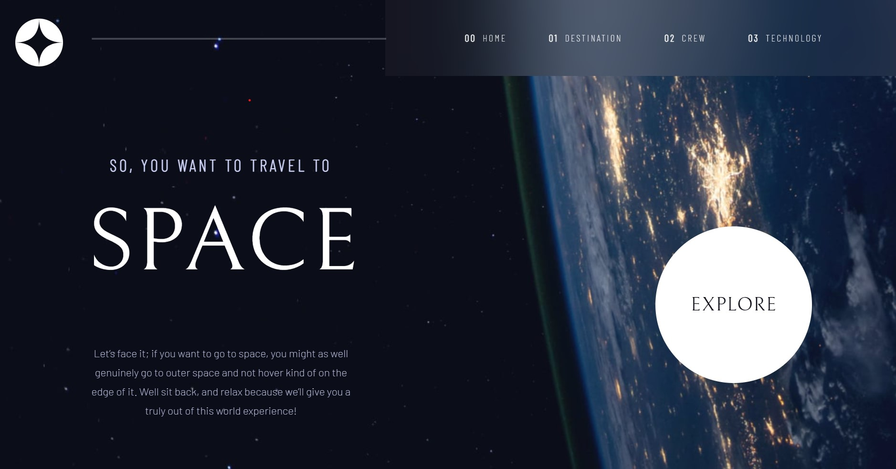

# Frontend Mentor - Space tourism website solution

This is a solution to the [Space tourism website challenge on Frontend Mentor](https://www.frontendmentor.io/challenges/space-tourism-multipage-website-gRWj1URZ3). Frontend Mentor challenges help you improve your coding skills by building realistic projects.

## Table of contents

- [Overview](#overview)
  - [The challenge](#the-challenge)
  - [Screenshot](#screenshot)
  - [Links](#links)
- [My process](#my-process)
  - [Built with](#built-with)
  - [What I learned](#what-i-learned)
  - [Continued development](#continued-development)
  - [Useful resources](#useful-resources)
- [Author](#author)

## Overview

### The challenge

Users should be able to:

- View the optimal layout for each of the website's pages depending on their device's screen size
- See hover states for all interactive elements on the page
- View each page and be able to toggle between the tabs to see new information

### Screenshot



### Links

- Live Site URL: [Add live site URL here](http://https://astro-tour.netlify.app/)

## My process

### Built with

- [React](https://reactjs.org/) - JS library
- Sass
- Flexbox
- Mobile-first workflow
- [Netlify](https://www.netlify.com/) - Hosting

### What I learned

I am particularly proud that I was able to implement the website using mobile-first approach. I learned that it is important to think about the layout of the website in terms of the screen size. I learned how to use Sass to style the website.
I also learned how to use tools such as media queries and flexbox to create a responsive layout .
Finally, I learned how to use the useEffect hook to set the value of a state based on the recent value of another state. This was an area in which I struggled a lot.

```js
const getData = () => {
  fetch("./data.json", {
    headers: {
      "Content-Type": "application/json",
      Accept: "application/json",
    },
  })
    .then((res) => res.json())
    .then((data) => {
      setDestinations(data.destinations);
    });
};

useEffect(() => {
  getData();
}, []);

useEffect(() => {
  setDestination((data) => {
    data = [destinations[0]];
    return data;
  });
}, [destinations]);
```

### Continued development

In the future, I would like to make use of css grid to design websites. I would alsolike to explore advanced React concepts to aid in my implementation of websites

### Useful resources

- [Example resource 1](https://www.reactjs.org) - This helped me with the useEffect hook. I really liked this pattern and will use it going forward.
- [Example resource 2](https://css-tricks.com/) - This is an amazing article which helped me finally understand css flexbox. I'd recommend it to anyone still learning this concept.

## Author

- Website - [Andrew Efurhievwe E.](https://andys-portfolio.netlify.app)
- Frontend Mentor - [@andyriles](https://www.frontendmentor.io/profile/andyriles)
- Twitter - [@andy_riles](https://www.twitter.com/andy_riles)

# Getting Started with Create React App

This project was bootstrapped with [Create React App](https://github.com/facebook/create-react-app).

## Available Scripts

In the project directory, you can run:

### `yarn start`

Runs the app in the development mode.\
Open [http://localhost:3000](http://localhost:3000) to view it in the browser.

The page will reload if you make edits.\
You will also see any lint errors in the console.
